# CareCompanion - Healthcare AI Assistant

A multi-agent patient-services assistant built on **Microsoft Foundry**, delivered and documented the way a regulated-industry AI rollout requires: architecture and governance as one system, not two separate deliverables.

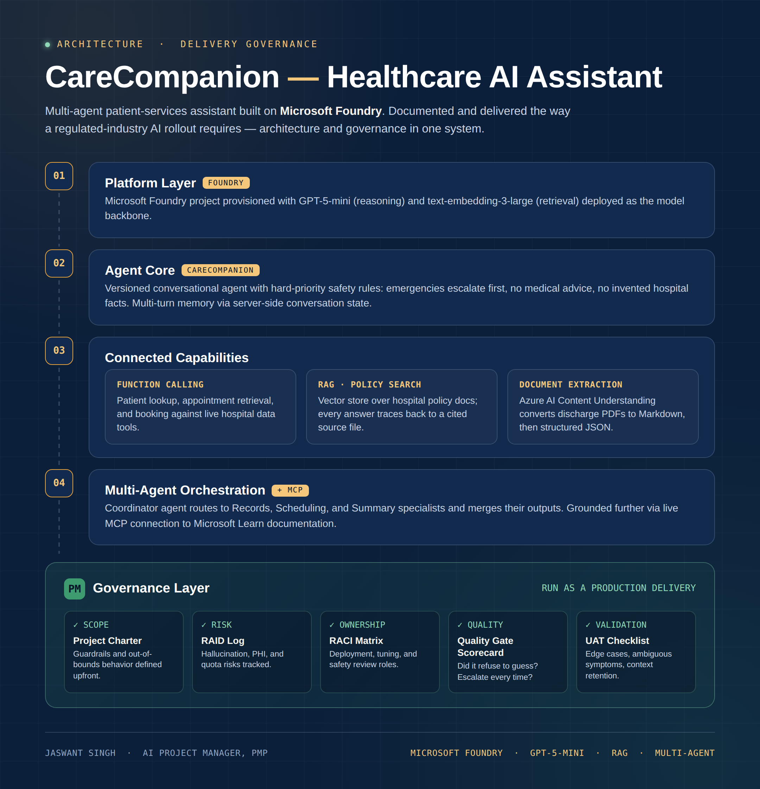

**Stack:** Microsoft Foundry · GPT-5-mini · text-embedding-3-large · Azure AI Search (RAG) · Azure AI Content Understanding · Microsoft Agent Framework · MCP

---

## Why this exists

Most "I built an agent" repos stop at the demo. The part that actually determines whether an AI system is safe to put in front of a patient - or a technical recruiter's scrutiny - is the governance layer underneath it: proof that the agent refuses to guess a hospital policy, escalates emergencies without fail, and never invents a fact it wasn't given.

This repo documents both halves: the technical build, and the project management discipline that would sit around it in a real healthcare delivery - Project Charter, RAID Log, RACI Matrix, Quality Gate Scorecard, and UAT Checklist, all in [`/docs`](./docs).

> **Attribution:** Built by working through K21Academy's *"Building an End-to-End Healthcare AI Assistant with Microsoft Foundry"* lab (guide by Atul Kumar / K21Academy). All patient, appointment, and policy data is synthetic. The technical build follows the lab; the governance layer, documentation, and delivery framing are my own work as I develop as an AI Project Manager.

---

## What it does

| Capability | Description |
|---|---|
| 🛡️ **Safety-first agent** | Hard-priority rules: emergencies escalate before anything else, no medical advice ever given, no hospital fact invented |
| 🔧 **Function calling** | Patient lookup, appointment retrieval, and booking against live hospital data tools |
| 📚 **RAG over policy docs** | Vector store indexing hospital policy files; every answer is citation-grounded or explicitly declines |
| 📄 **Document extraction** | Azure AI Content Understanding turns discharge-note PDFs into Markdown, then structured JSON |
| 🤝 **Multi-agent orchestration** | Coordinator agent routes to Records, Scheduling, and Summary specialists and merges their output |
| 🔗 **MCP grounding** | Live connection to the Microsoft Learn MCP server for documentation-grounded technical answers |

---

## Architecture

```
Platform Layer        Microsoft Foundry project · GPT-5-mini · text-embedding-3-large
      │
Agent Core             CareCompanion - versioned agent, safety rules, multi-turn memory
      │
Connected Capabilities  Function Calling  │  RAG · Policy Search  │  Document Extraction
      │
Multi-Agent Layer      Coordinator → Records Specialist + Scheduling Specialist + Summary Agent
      │                      + MCP → Microsoft Learn (live doc grounding)
      │
Governance Layer       Project Charter · RAID Log · RACI Matrix · Quality Gate Scorecard · UAT Checklist
```

Full visual version: [`assets/architecture-diagram.png`](assets/architecture-diagram.png)

---

## Build evidence

Every screenshot below is from an actual run against the deployed `jas-healthcare` Foundry project - not a mockup.

<details>
<summary><b>1 · Platform setup - Foundry project, model deployment</b></summary>
<br>

Foundry project created (`jas-healthcare`, resource group `rg-jas-healthcare`, East US 2):

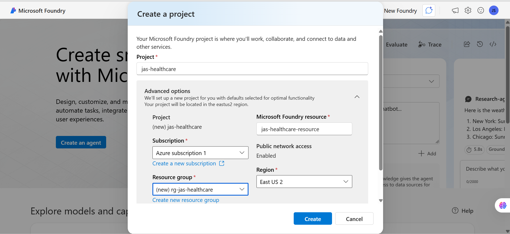

Project and Azure OpenAI endpoints issued:

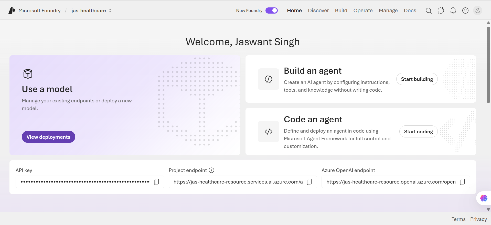

`gpt-5-mini` and `text-embedding-3-small` deployed and succeeded:

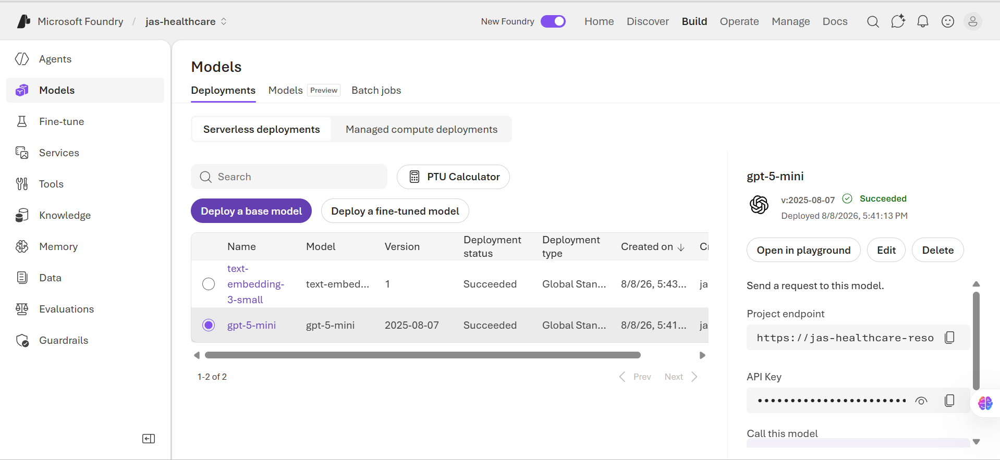

</details>

<details>
<summary><b>2 · Agent core - first call, agent creation, safety behavior</b></summary>
<br>

First stateless call confirms auth and deployment are working:

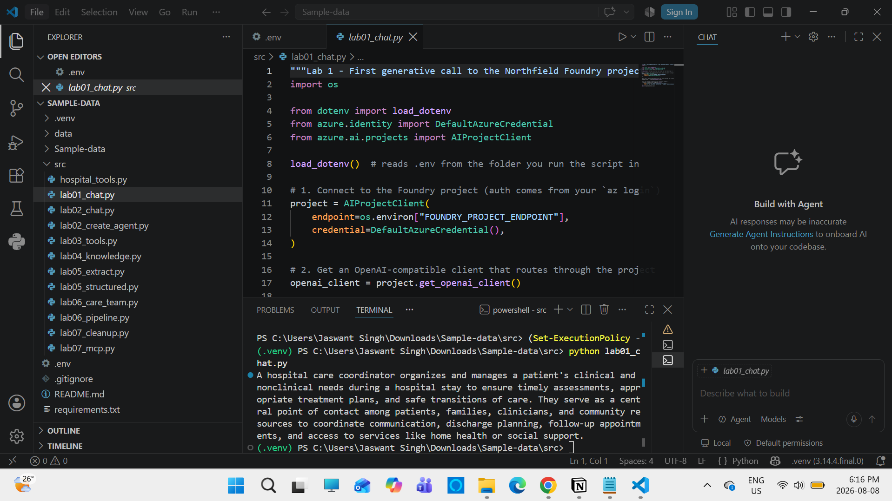

CareCompanion agent created and versioned (v1) with hard-coded safety instructions:

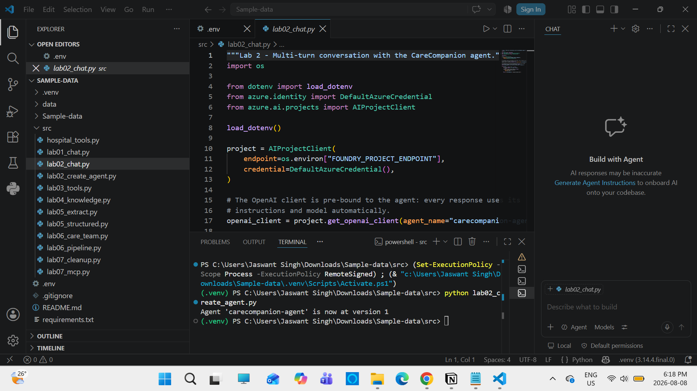

Multi-turn conversation - agent declines to guess visiting-hours policy, asks clarifying questions, and retains context turn-to-turn instead of inventing an answer:

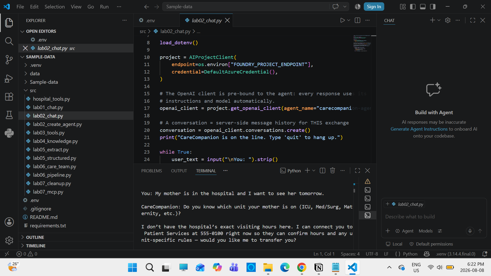

</details>

<details>
<summary><b>3 · Connected capabilities - function calling, RAG, document extraction</b></summary>
<br>

**Function calling** - patient lookup returns real record data, no invented fields:

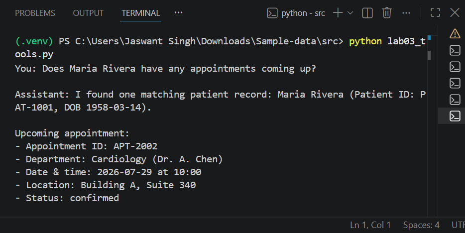

Tool-chained booking - confirms patient identity before writing a new appointment:

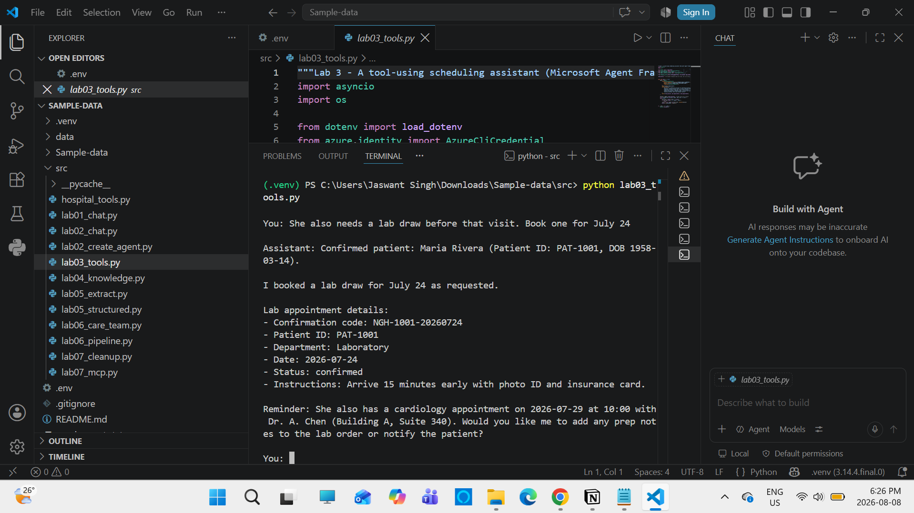

Duplicate-booking safeguard - agent checks existing appointments before creating a new one and asks for explicit confirmation rather than silently double-booking:

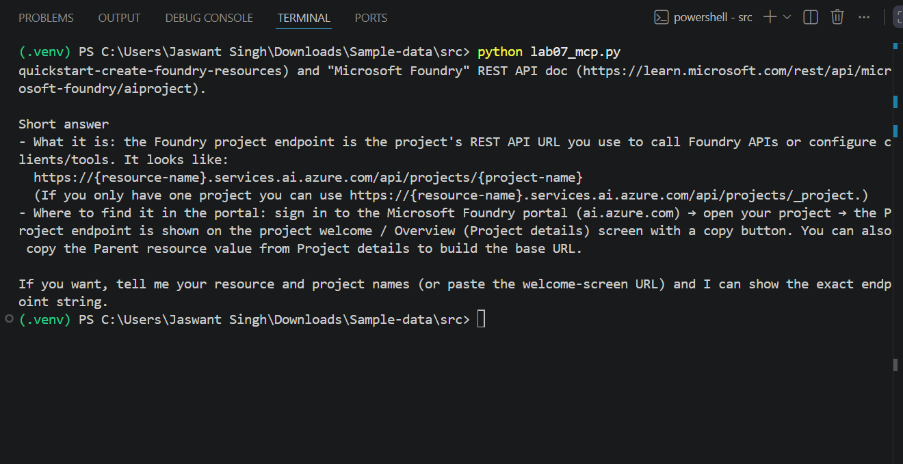

**RAG** - ICU visiting-hours question answered strictly from indexed policy files:

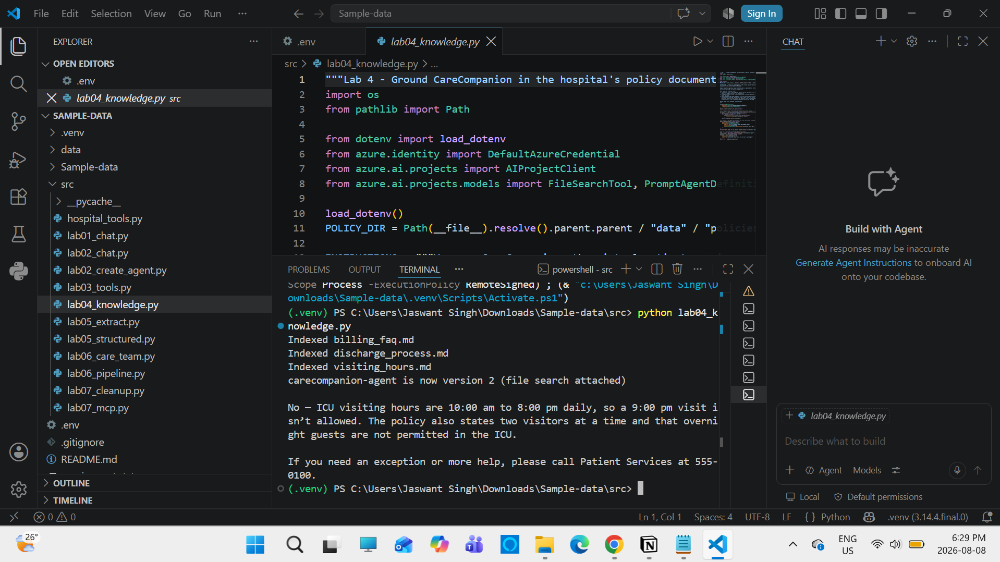

RAG refusal - when the indexed policies don't cover a question (volunteer parking), the agent says so instead of fabricating a policy:

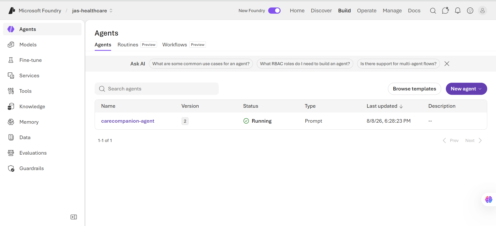

**Document extraction** - discharge-note PDF converted to structured JSON (medications, follow-ups, warning signs) via Azure AI Content Understanding:

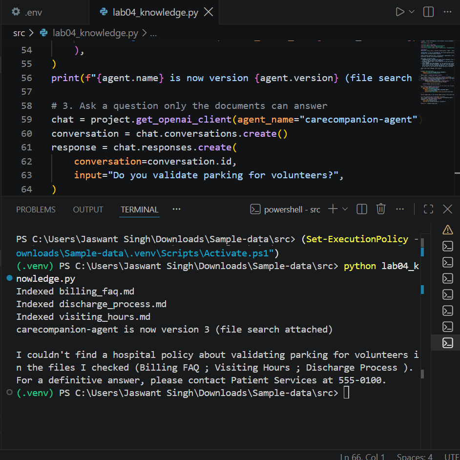

</details>

<details>
<summary><b>4 · Multi-agent orchestration + MCP</b></summary>
<br>

Coordinator agent consults Records and Scheduling specialists, checks for an existing appointment within the required window, and explains its reasoning before taking action:

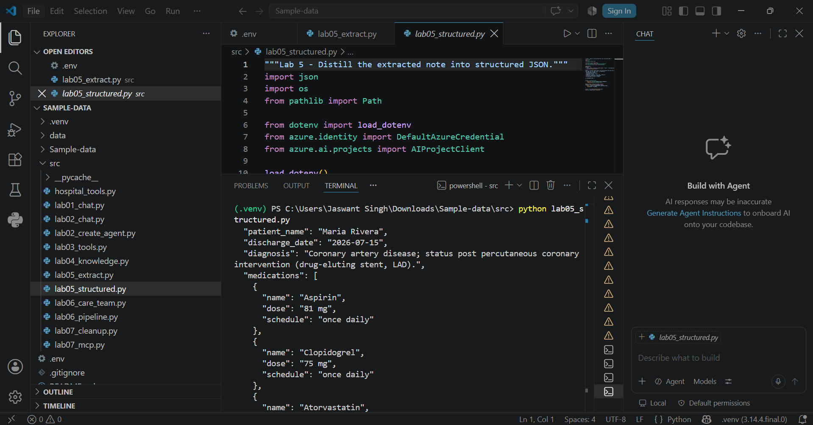

Sequential two-agent pipeline turns a raw discharge note into a patient-friendly after-visit summary - facts preserved, no new medical advice added:

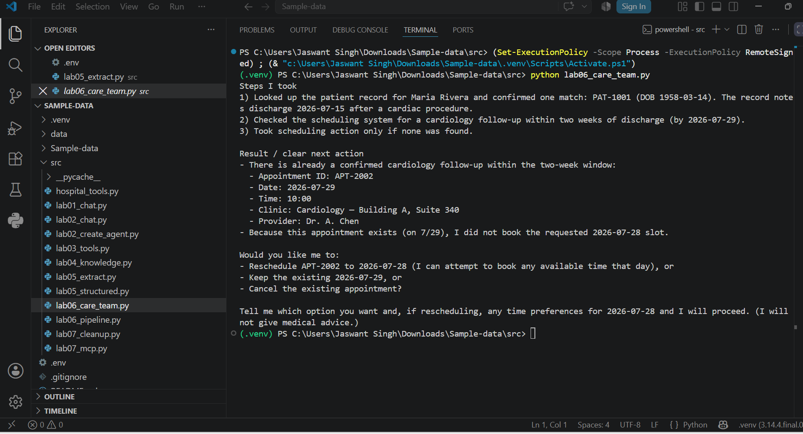

Agent grounded via live MCP connection to the Microsoft Learn documentation server:

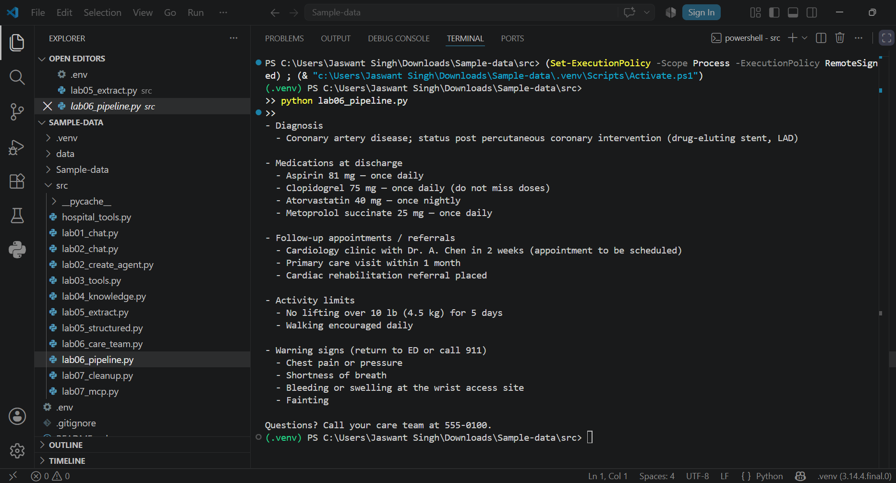

</details>

<details>
<summary><b>5 · Deployed state - Foundry agent registry</b></summary>
<br>

CareCompanion agent live and running in the Foundry portal, version 2 (file search / RAG attached):

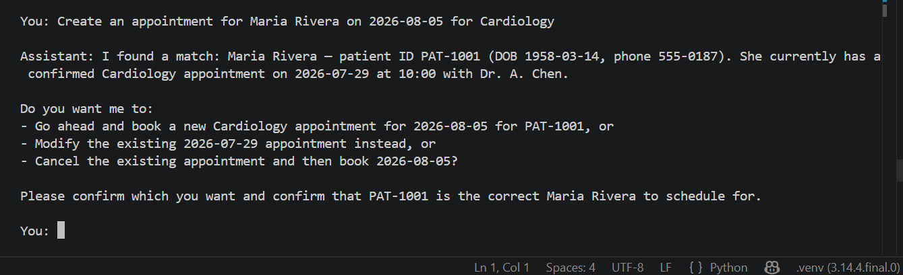

</details>

---

## Governance artifacts

Delivered the way I'd run this if it were a real hospital engagement - scoped, risk-tracked, owned, and quality-gated before anything touched patient-facing behavior.

| Artifact | Purpose |
|---|---|
| [`docs/PROJECT_CHARTER.md`](docs/PROJECT_CHARTER.md) | Scope, safety guardrails, out-of-bounds behavior, success criteria |
| [`docs/RAID_LOG.md`](docs/RAID_LOG.md) | Risks, assumptions, issues, dependencies - hallucination, PHI, model quota |
| [`docs/RACI_MATRIX.md`](docs/RACI_MATRIX.md) | Ownership across model deployment, agent tuning, safety review |
| [`docs/QUALITY_GATE_SCORECARD.md`](docs/QUALITY_GATE_SCORECARD.md) | Did the agent actually refuse to guess? Escalate every time? |
| [`docs/UAT_CHECKLIST.md`](docs/UAT_CHECKLIST.md) | Edge cases: ambiguous symptoms, unknown policies, context retention, duplicate bookings |

---

## Repo structure

```
carecompanion-healthcare-ai-assistant/
├── README.md
├── requirements.txt
├── assets/                     screenshots + architecture diagram
└── docs/
    ├── PROJECT_CHARTER.md
    ├── RAID_LOG.md
    ├── RACI_MATRIX.md
    ├── QUALITY_GATE_SCORECARD.md
    └── UAT_CHECKLIST.md
```

*(Lab source code - `lab01_chat.py` through `lab07_mcp.py`, `hospital_tools.py` - follows K21Academy's CareCompanion starter structure and is available on request; this repo focuses on the delivery and governance artifacts.)*

---

## About

Built by **Jaswant Singh** - AI Project Manager (PMP), transitioning from operations and delivery leadership into AI Project Management / AI Implementation PM roles.

[LinkedIn](https://www.linkedin.com/in/jaswant-singh-pmp/) · [GitHub](https://github.com/JaswantOnGit)
